# Legaluga UYAP Asistanı

UYAP Avukat Portalı'ndaki dosyalarınızı kişi adı, dosya numarası, mahkeme veya notla bulun; dosyayı ve evrakını aynı panelden açın.
Eklenti, **Av. Hasan İmer Akın** tarafından meslektaşlarının ücretsiz kullanımı için geliştirilmiştir.

**[Chrome Web Mağazası'ndan kurun](https://chromewebstore.google.com/detail/legaluga-uyap-asistan%C4%B1/aicknihmpdcbfgidifffinnbgbghkmcn?hl=tr)** · [Yerel demo](#geliştiriciler-için-demo-ve-testler) · [Hata ve öneriler](https://github.com/hasanimer/legaluga-uyap-ui/issues)

Bu depo arayüzü, genel araçları ve yerel şifreleme altyapısını **MIT lisansıyla** sunar. UYAP işlem motoru özel kaynaklıdır; tam eklenti mağazadan kurulur.

> Bu rehber, **1.19.34** paketinin davranışlarını anlatır. Mağazada yayımlanan sürüm ayrıca kontrol edilmelidir; buradaki yeni özelliklerin tamamı mağaza sürümünde henüz bulunmayabilir.

Görseller gerçek arayüz bileşenlerinden **örnek verilerle** hazırlanmıştır; gerçek kişi, dava veya UYAP oturumu içermez.

## İlk kurulum

1. Mağaza bağlantısından **Chrome'a ekle**'ye basın; Legaluga simgesini araç çubuğuna sabitleyin.
2. [UYAP Avukat Portalı](https://avukat.uyap.gov.tr/)'nı açın. İlk kurulum **Legaluga Asistan** panelinde otomatik görünür; ayrı kurulum sekmesi açılmaz.
3. Önce bağlantı ve UYAP oturumu kontrol edilir. Giriş gerekiyorsa resmî UYAP ekranında tamamlayın; giriş bilgilerinizi Legaluga paneline yazmanız gerekmez.
4. İlk bağlantıda hesabınızdaki ad **vekil adı** alanına alınır. Bu adın vekil olarak geçtiği taraflar **Müvekkil** olarak gösterilir. Gerektiğinde adı düzenleyin; birden fazla adı virgülle ayırabilirsiniz.
5. Taranacak yargı türlerini, açık/kapalı dosya kapsamını ve gerekirse savcılık illerini seçin. Ardından görünüm, güncelleme ve bildirim ayarlarını belirleyin.
6. **Kaydet ve taramayı başlat** ilk taramayı başlatır. **Kurulumu tamamla** yalnız seçimlerinizi kaydeder.

Tarama başlatırken oturum hazır değilse istek bağlantıyı bekler. Giriş tamamlanıp bağlantı doğrulandığında seçtiğiniz kapsamda kendiliğinden başlar; yeniden **Güncelle**'ye basmanız gerekmez. Bekleyen isteği iptal edebilirsiniz. Bir bağlantı veya doğrulama hatası gösterilirse paneldeki yönlendirmeyi izleyin.

Yeni kurulumda mahkeme yargı türleri ile açık ve kapalı dosyalar seçilidir. Savcılık taraması, otomatik güncelleme, yeni evrak takibi ve teknik hata raporları başlangıçta kapalıdır. Kurulumdaki kapsam, UYAP dosyalarını seçer; bilgisayarınızdaki klasörleri taramaz.

Seçimleri daha sonra **Ayarlar** içinden değiştirebilir veya **Kurulum seçimlerini yeniden aç** ile bağlantı, kapsam ve ayar adımlarına dönebilirsiniz. Yeni kapsam sonraki taramada uygulanır; kapsam dışında kalan eski yerel kayıtlar korunur.

**1. Bağlantıyı kontrol edin; gerekirse UYAP’ın kendi ekranında giriş yapın.**

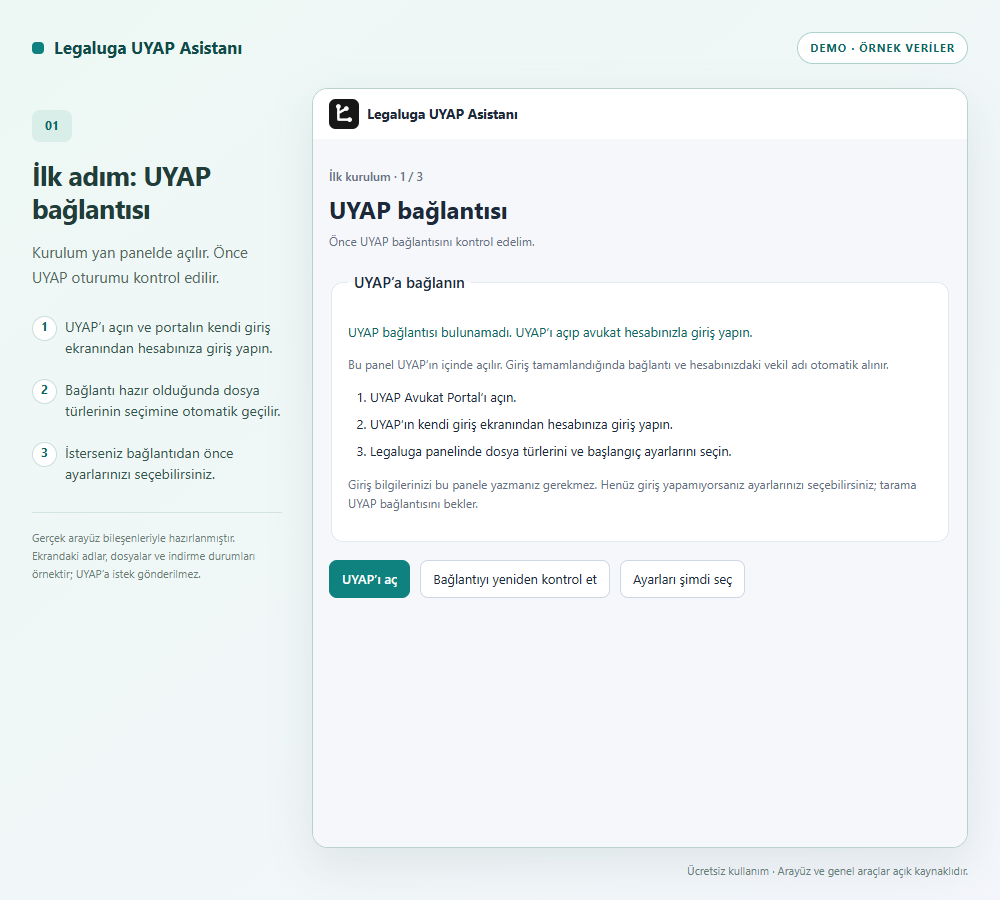

**2. Taranacak yargı türleri ile açık/kapalı dosya kapsamını seçin.**

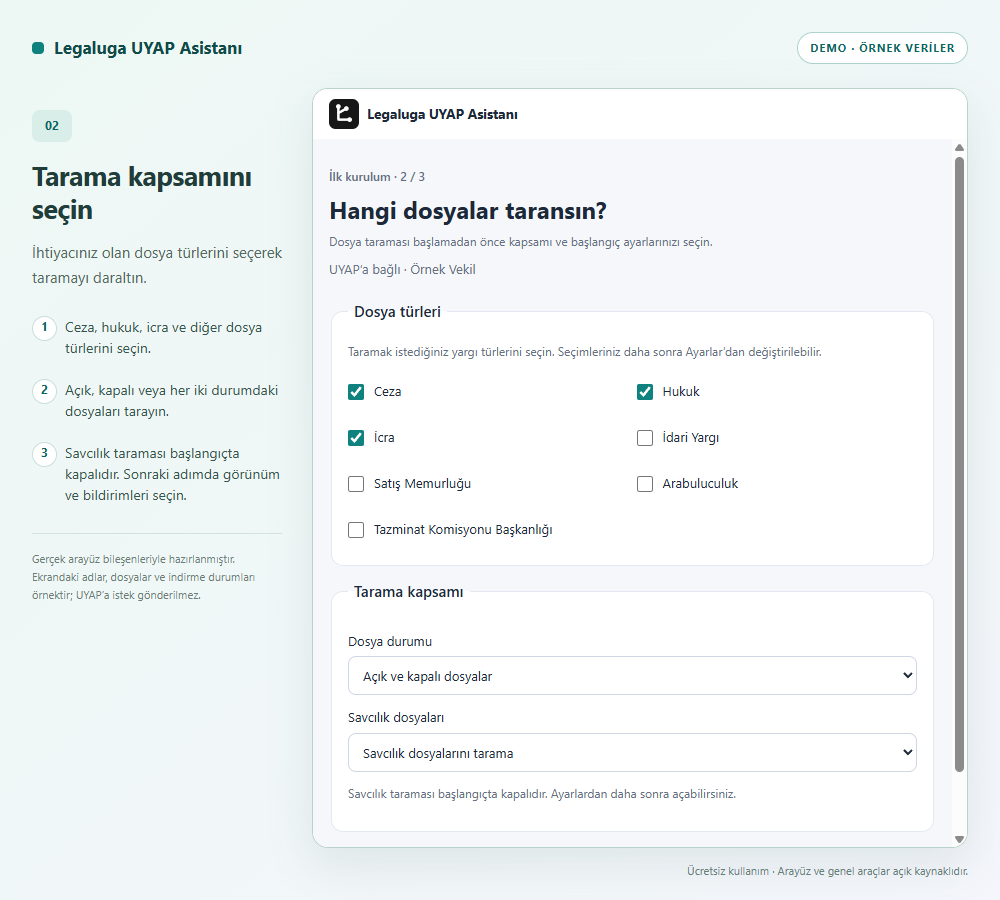

## Günlük kullanım

UYAP sekmesinde Legaluga simgesi veya **Alt+Shift+D** paneli açar. Paneli sabitleyebilir, genişliğini değiştirebilir ve açık/koyu temayı seçebilirsiniz. Başka bir sitedeyken simge hızlı arama penceresini açar; dosya açma işlemi UYAP sekmesinde yürür.

- **Güncelle:** Seçili kapsamın dosya listesini mevcut UYAP oturumunuzla yerel indekse alın.
- **Ara:** Ad, dosya numarası, mahkeme veya kendi notunuzu yazın. Türkçe karakter varyantları normalleştirilir; `2031/123` gibi dosya numaralarıyla da arayabilirsiniz.
- **Daralt:** Yargı türü, dosya durumu, müvekkil ve yeni evrak filtrelerini kullanın; sonuçları uygunluğa, açılış tarihine veya dosya numarasına göre sıralayın.
- **Aç:** **Dosya Görüntüle** dosya ekranını, **Evrak Görüntüle** doğrudan evrakları açar. Kişi adına tıklayarak aynı adın geçtiği dosyaları görebilirsiniz.
- **Takip et:** **Duruşmalarım** ve **Yeni evrak** görünümlerini kullanın. Yeni evrak takibini ayarlardan açın; ilk tarama başlangıç listesi oluşturur.

Arama kutusunda **↑ ↓** ile sonuç seçin, **Enter** ile açın, **Esc** ile geri dönün. Arama ve filtreler kayıtlı yerel veriler üzerinde çalışır. Güncelleme ve yeni belge okuma için UYAP bağlantısı gerekir.

Müvekkil etiketi, ayarlardaki vekil adıyla dosyanın taraf/vekil kaydının eşleşmesine dayanır. Etiket görünmüyorsa önce bu adı kontrol edin. Aynı adlı farklı kişiler otomatik olarak ayırt edilemeyebilir; savcılık dosyalarında UYAP taraf bilgisini vermediğinde müvekkil eşlemesi yapılamaz.

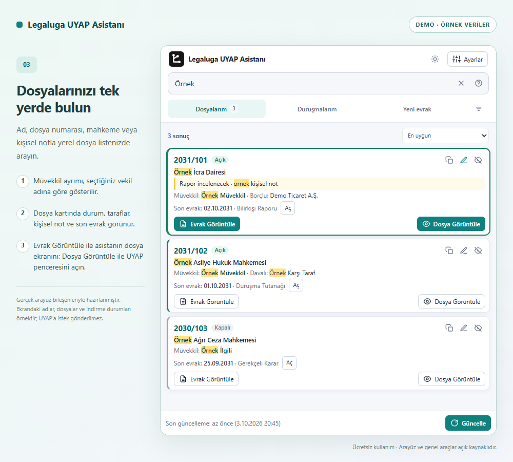

## Dosya ekranı

| Sekme | Ne gösterir? |
|---|---|
| **Özet** | Dosya bilgileri, son hareketler ve taraflar; icra dosyalarında UYAP'ın hesap ve tahsilat başlıkları ile tutarları. |
| **Evrak** | Gerçek UYAP evrak türlerine göre klasörler, ana evraklar ve ekleri; PDF, UDF ve TIFF görüntüleme. |
| **Banka sorgusu** | İcra dosyasında borçlu seçimi, banka sorgusu, talep kontrolü ve banka cevapları. |
| **Tebligat sorgusu** | Seçilebilir tebligat zarfları, içerik ve barkod, eşleşen mazbatanın olayları ve isteğe bağlı resmî hizmet sorgusu. |
| **Safahat** | Son kaydedilmiş işlem listesi ve kullanıcı düğmeyle başlattığında güncel UYAP kaydı. |
| **Notlar / Toplu indir** | Dosyaya ait notlar ve seçtiğiniz evrakların özgün biçimleriyle indirilmesi. |

Masaüstünde **Özet** ana pencereye sığacak şekilde düzenlenir; uzun hesap veya taraf listeleri kendi bölümlerinde kaydırılır. Dar ekranda bölümler alt alta yerleşir. Tutarlar UYAP'tan geldiği gibi gösterilir; eklenti dosya borcu hesaplamaz.

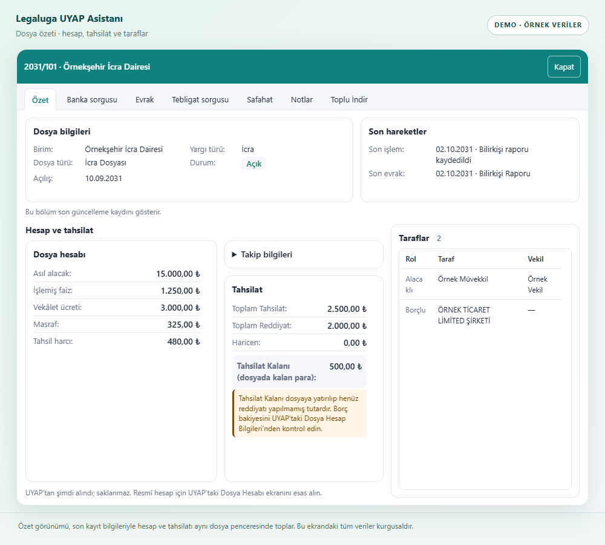

**Evrak** klasöründeki sayı ana evrak ve eklerin toplamıdır. Ekler ana evrakın klasöründe kalır. **Son 20** düz listeyi, **Tümü** evrak türüne göre klasörleri açar. Klasörler alfabetik sıralandığı için **Tarih ⓘ** kontrolü pasiftir; açıklaması tarih sırası için düz listeye geçmenizi belirtir. Arama ve klasör/düz liste seçimiyle görünümü daraltabilirsiniz. Klavyede **↑ ↓** ile gezin, **→ / ←** ile klasörü açıp kapatın, **Enter** ile belgeyi açın.

UDF ve TIFF önizlemesi belgeyi cihazınızda işler. UDF'nin sayfa düzeni resmî editörden farklı olabilir; e-imza doğrulaması yapılmaz. Okunamayan veya desteklenmeyen belgede özgün dosyayı indirip uygun araçla açın. Dosya ekranındaki özet ve önizlemeyi resmî belgeyi kontrol ederek kullanın.

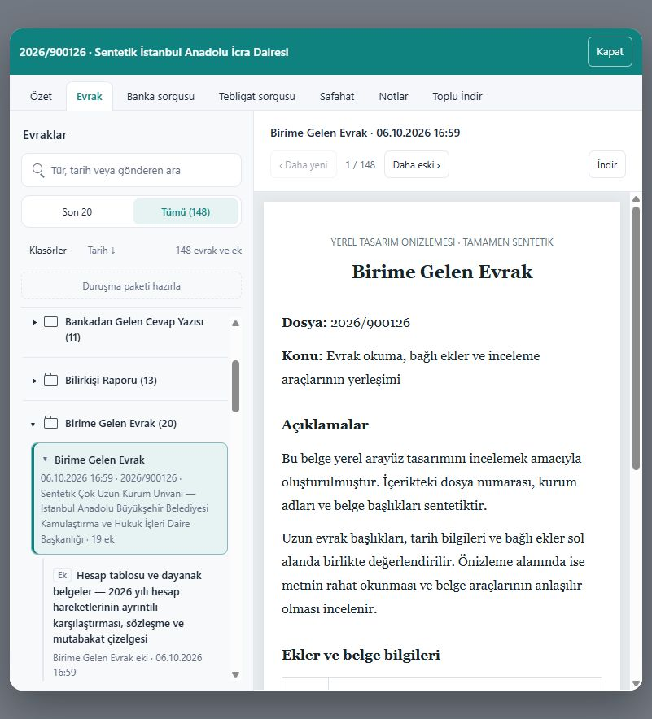

**Safahat** sekmesini açmak yeni sorgu yapmaz. **Safahatı getir / Güncelle** son işlem listesini alır; son başarılı çekimin tarihi görünür. Kayıt bu Chrome profilinde şifreli saklanır. Aynı dosyada başarılı çekimden sonra **60 dakika** beklenir; hata veya iptal önceki kaydı silmez. Dosya listesini güncellemek safahatı otomatik sorgulamaz.

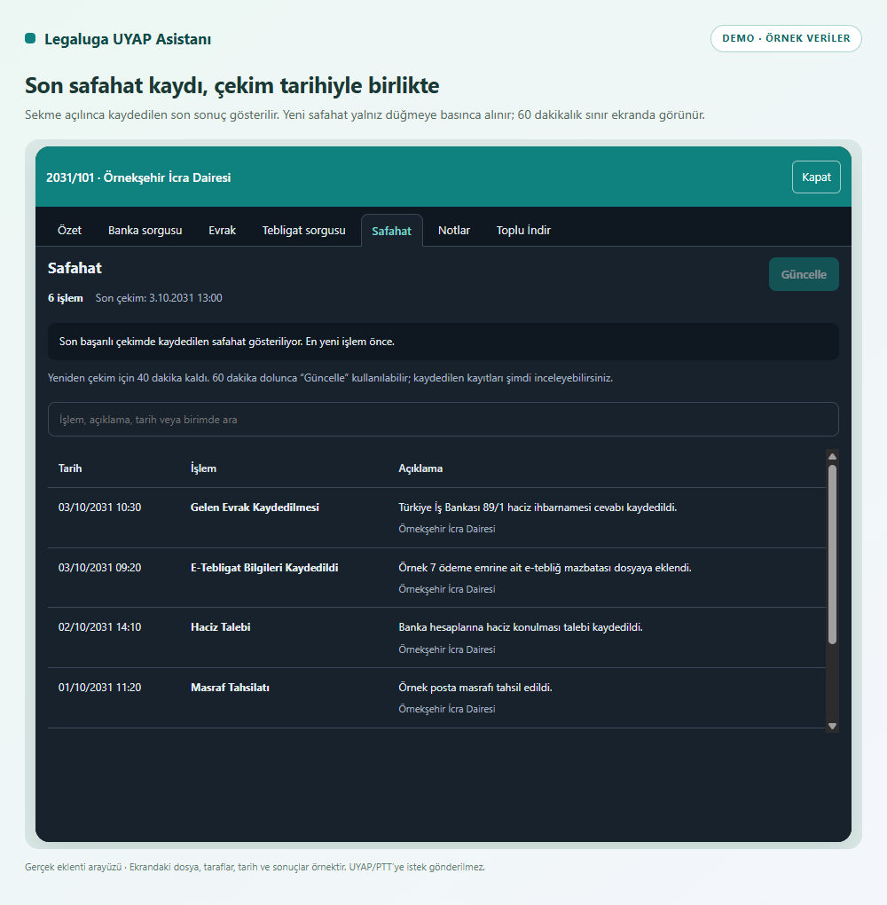

## Banka sorgusu ve cevapları

İcra dosyasında **Banka sorgusu → Borçluları getir** ile başlayın. Gerçek kişiyi adıyla, şirket veya kurumu unvanıyla seçin; ardından **Bankaları sorgula** düğmesine basın.

Önce UYAP'ın sorgu uygunluğu ve ücret bilgisi kontrol edilir. Ücret bildiriliyorsa tutar gösterilir ve ayrıca onayınız istenir. Uygunluk veya ücret yanıtı doğrulanamazsa sorgu başlatılmaz. Ücretli sorgu kendiliğinden tekrarlanmaz.

Şirket/kurum yanıtı seçili dosya ve borçluyla doğrulanır. Tek bir bilinen bankayla eşleşen unvan kısa adla gösterilir; tanınmayan veya çelişen unvan özgün hâliyle korunur. Kurum yanıtından EFT kodu üretilmez. Eksik ya da çelişen sonuç önceki kaydı değiştirmez; hesap ve IBAN alanları takip kaydına alınmaz.

**Banka cevapları**, dosyadaki cevap sayısını, özgün evrak başlıklarını ve tarihlerini gösterir. Cevap metninden haciz, bakiye veya borçlu eşleşmesi yorumu çıkarılmaz. **Cevabı aç** özgün evrakı ayrı önizleme penceresinde gösterir; kapatınca aynı banka listesinde kalırsınız. Açtığınız cevaplar **Görüntülendi** işareti ve farklı renkle ayırt edilir. Listeyi yenilemek veya cevabı açmak ücretli banka sorgusu başlatmaz.

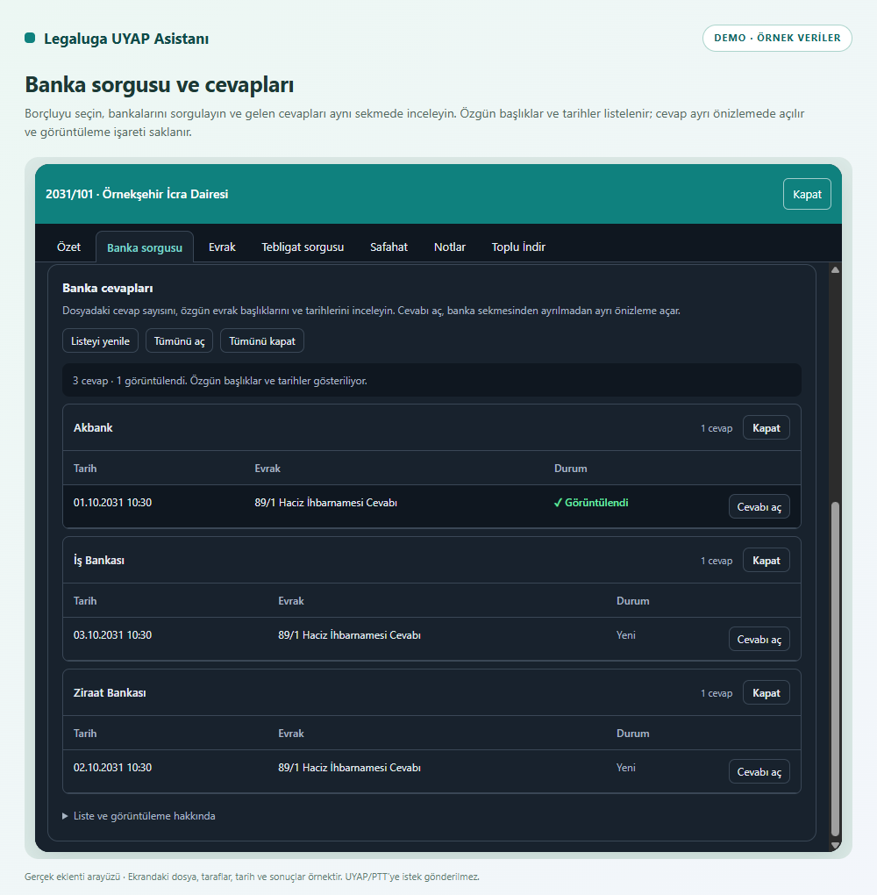

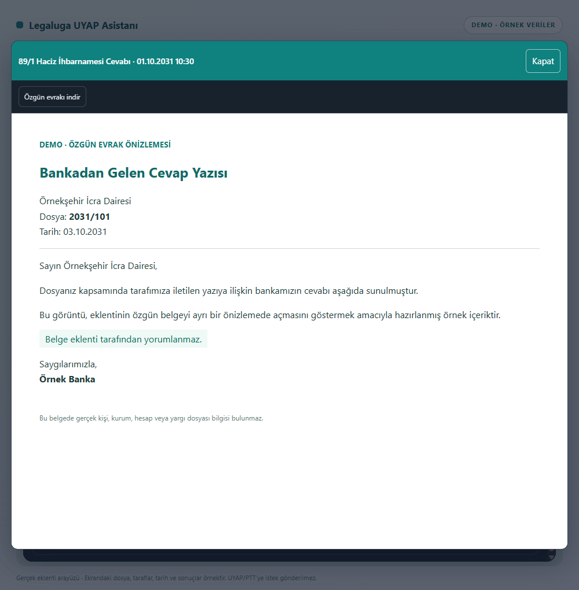

**Talepleri kontrol et** kayıtlı sorguyu dosyanın ilgili evraklarıyla karşılaştırır. Talep göndermez; talebin gönderildiğini veya tebliğ edildiğini tek başına kanıtlamaz. Cevap bulunmaması da talep gönderilmediği anlamına gelmez.

Eklenti ücretsizdir. UYAP banka sorgusunun ücretleri, limitleri ve PTT/UETS hizmetlerinin koşulları ilgili resmî hizmete aittir; eklenti bu koşulları kaldırmaz.

## Tebligat ve UETS

Tebligat listesinde zarflar/tebligatlar seçilir; mazbatalar ayrı seçilecek gönderi olarak listelenmez. Her satırda muhatap, tarih ve evrak numarası, hizmet (**Posta · PTT** ya da **E-tebligat**), UYAP'ın kaydettiği durum (ör. **UYAP: Tebliğ Edildi**) ve sorgu durumu görünür. Tek tebligatı satırdaki **Sorgula** ile, birkaçını seçim kutuları ve **Seçilenleri sorgula** ile sırayla sorgularsınız. Liste birden fazla tür içeriyorsa **Tümü / Posta / E-tebligat** süzgeci çıkar.

Hizmet, UYAP açıklamasındaki tebligat türünden (**Normal Tebligat** posta, **Elektronik Tebligat** e-tebligat) ve zarfın kendisinden belirlenir. E-tebligat zarfı UETS adresini taşır; hizmet adı yazmayan, tek barkodlu posta zarfı PTT posta tebligatı sayılır ve satırda "zarfta hizmet yazmıyor" diye belirtilir. Barkod okunamazsa (taranmış zarf), zarfta birden fazla barkod varsa ya da hizmet çelişkiliyse sorgu kendiliğinden gönderilmez: satırda bulunan barkodlar ve bir barkod kutusu çıkar, **PTT'de sorgula** ya da **E-tebliğ mazbatasında ara** ile siz seçersiniz.

E-tebligatta önce aynı dosyadaki eşleşen e-tebliğ mazbatası aranır. Bulunursa kaynağı ve olay kayıtları gösterilir; bu okuma için UETS'ye ayrıca giriş gerekmez. Mazbata bulunamazsa **UETS sayfasını aç** düğmesi sunulur; kendiliğinden yeni sekme açılmaz.

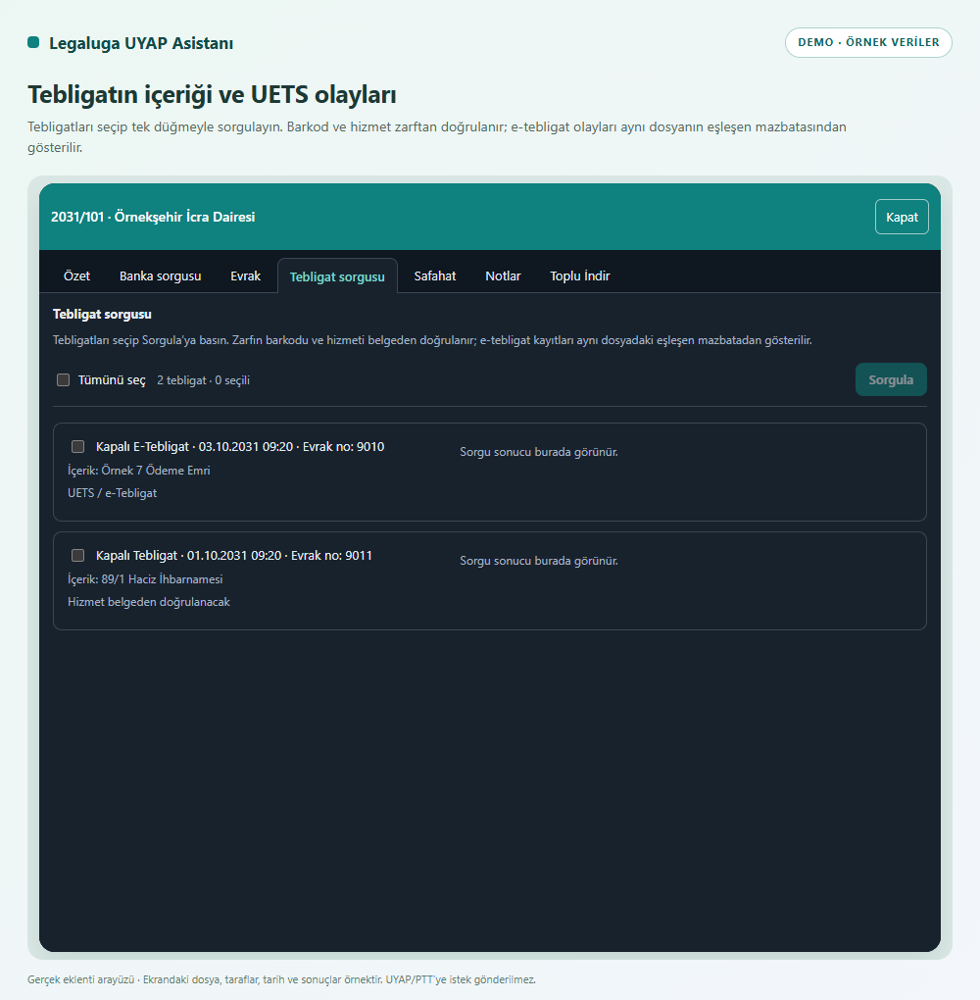

**Sorgula**, seçtiğiniz evrakın içeriğini ve barkodunu da okur; ayrı **İçerikleri oku** adımı gerekmez. Tekil ve eşleşen mazbatada teslim, hesaba konulma, açılma ve okundu sayılma kayıtları belge üzerindeki tarihleriyle gösterilir. Ekran açıkken her mazbata bir kez okunur; aynı dosyadaki öteki e-tebligatlar aynı okumayı kullanır. Farklı belge/gönderilerin kayıtları birleştirilmez; hukuki süre hesabı yapılmaz. Taranmış veya çok barkodlu belgede özgün mazbatayı inceleyin.

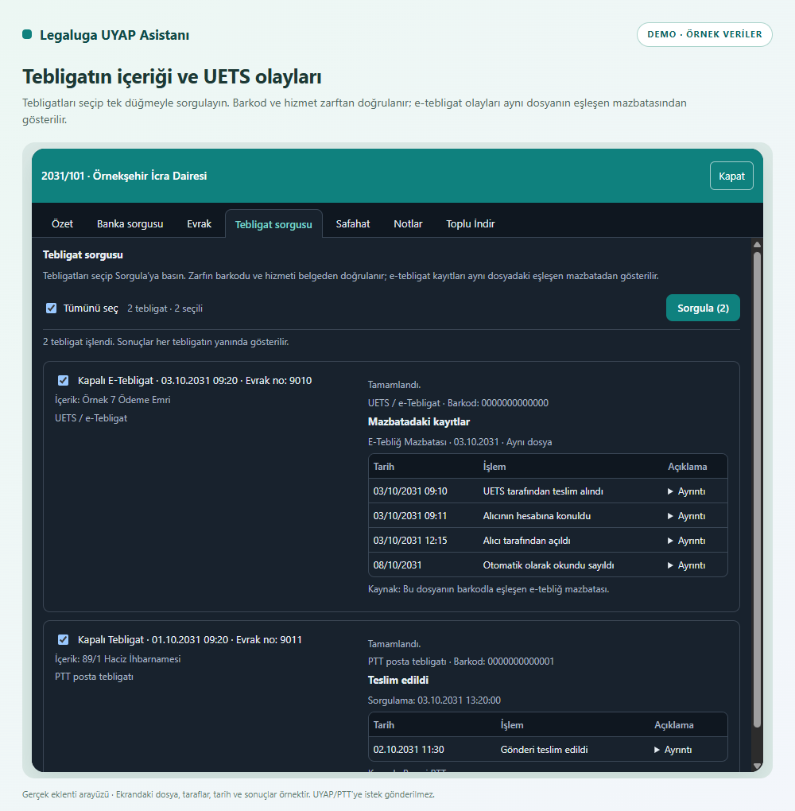

PTT sorgusu arka planda hazırlanır; tamamlanabilen sonuç tebligat sekmesinde gösterilir. Resmi hizmet giriş veya güvenlik doğrulaması isterse sayfayı ilgili düğmeyle açıp kendiniz tamamlayın. PTT'nin kendi güvenlik doğrulaması tamamlanmazsa satır hemen **Doğrulama bekliyor** olur: **Resmi PTT sayfasını aç** ile sayfaya geçip **SORGULA**'ya bir kez daha basın; sonuç yine tebligatın altına gelir. UETS'de **Gönderi Sorgulama** bölümüne geçmeniz gerekebilir. CAPTCHA ve oturum doğrulaması aşılmaz. PTT hareketleri zarfı ve iade-i taahhüt mazbatasını ayrı işaretlediğinde sonuçta **Zarfın teslimi** ile **Mazbata** ayrı satırlarda gösterilir; satırın durumu zarfın teslimini PTT'nin ifadesiyle gösterir (ör. muhtara teslim), birden çok teslim kaydında ilkini alır; teslimden sonra iade edilen zarf ya da yalnız mazbatanın teslimi olumlu sayılmaz. Mazbata hareketleri tabloda **Mazbata ·** ile başlar. Tebliğ tarihi veya süre hesaplanmaz.

Yalnız seçtiğiniz barkod ilgili resmî hizmete gönderilir. **Durdur** veya dosya ekranını kapatma bekleyen tebligat sorgusunu iptal eder. Barkod, belge metni ve tebligat sonuçları açık ekranın belleğinde tutulur; kalıcı kayıt ve hata raporuna eklenmez.

## Toplu indirme ve ilerleme

**Toplu indir** içinde tüm evrakları, son 20'yi, yeni evrakları veya Evrak sekmesinde listelenenleri seçin. **Evrak türleri** filtresinde **Tüm türler**, **Yalnız seçtiklerim** veya **Seçtiklerimi hariç tut** seçeneklerini kullanın. Filtre UYAP belge türüne göre çalışır; PDF/UDF dosya biçimi filtresi değildir.

**Ekleri de indir** açıksa seçilen ana evrakın ekleri de alınır. Ana evrak dışlanırsa bağlı ekleri de çıkar; bir ekin türünü ayrıca dışlayabilirsiniz. Bu seçeneği kapatırsanız hiçbir ek alınmaz. Başlatmadan önce ana evrak, ek ve toplam sayısını kontrol edin.

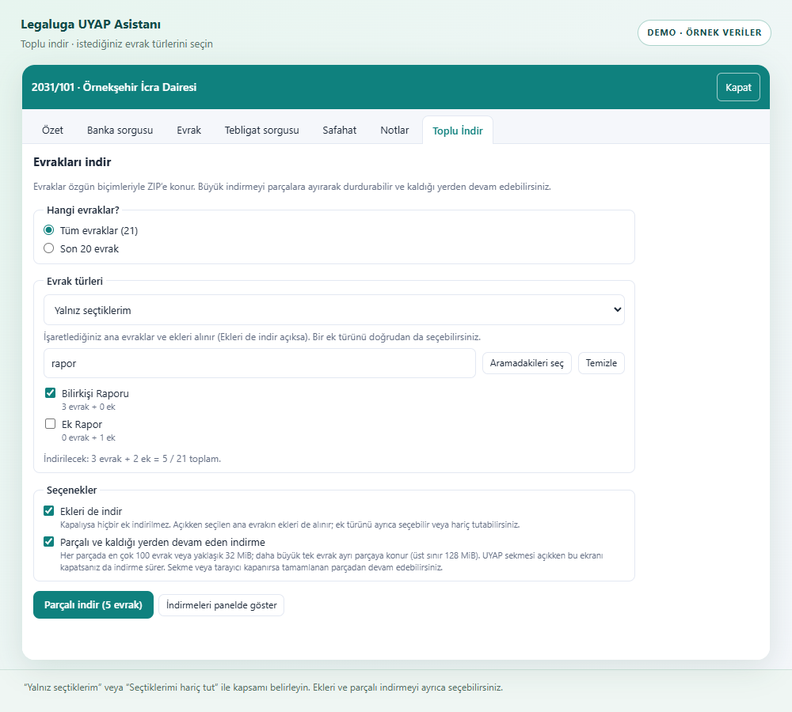

100'den fazla evrakta parçalı indirme otomatik seçilir; küçük listelerde de açabilirsiniz. Parçalar en çok **100 evrak veya yaklaşık 32 MiB** olacak şekilde hazırlanır. Büyük bir evrak tek başına ayrı parçaya konabilir; **tek evrak 128 MiB'yi aşarsa** açıklamayla durulur. Dosyalar UYAP'tan alınan özgün biçim ve baytlarla ZIP'e yazılır.

**Parçalı indirme, dosya penceresi veya Legaluga paneli kapansa da UYAP sekmesi açıkken sürer.** **↓ İndirmeler** panelinden sıradaki işleri, kaydedilen evrakları ve mevcut parçayı izleyin; **Duraklat / Devam et** ile yönetin. İlerleme yüzdesi diske kaydı doğrulanmış evraklara dayanır; mevcut parçada alınanlar ayrıca gösterilir.

UYAP sayfası yenilenirse aynı sekmede geçerli oturumla aktif indirme kaydedilmiş planına yeniden bağlanır. Devam eden Chrome ZIP kaydı kesinleşmeden aynı aralık yeniden indirilmez; henüz diske kaydedilmemiş parça yeniden alınabilir. Sekme veya tarayıcı tamamen kapanırsa tamamlanan parçalar korunur; aynı dosyada **Toplu indir → Kaldığı yerden devam et** ile sürdürün. Manuel duraklatma veya oturum/güvenlik hatası kendiliğinden yeni sorgu başlatmaz. Gerekirse **Dosyayı aç** ile duraklayan işin kaynağını yeniden bağlayın.

Devam edilen iş başlangıçta kaydedilen planı kullanır; sonradan değiştirdiğiniz kapsam ve tür seçimleri o planı değiştirmez. **Yeni indirme planı** ilerlemeyi onayınızla sıfırlar; bilgisayarınızdaki ZIP'leri silmez. **Son parçayı klasörde göster** tamamlanmış parçayı kaydedildiği klasörde gösterir.

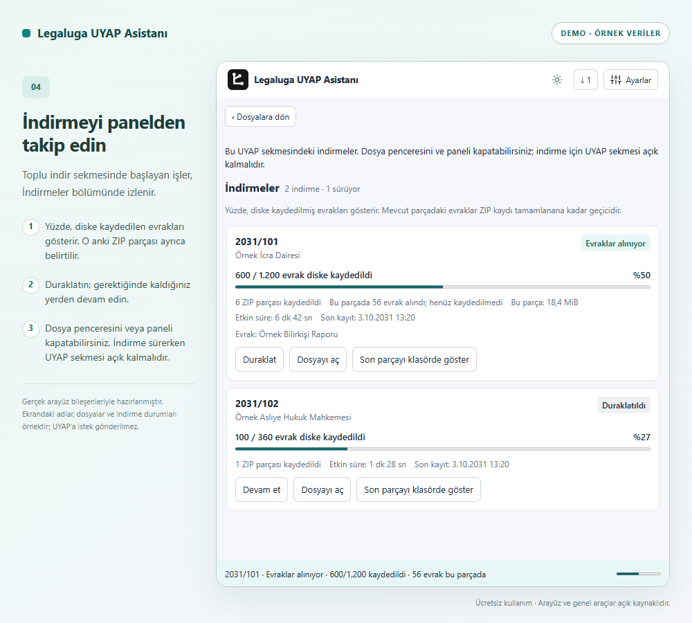

## Verileriniz ve şifreleme

Dosya indeksi, notlar, tercihler, safahat ve banka takip özetleri bu Chrome profilinde yerel olarak saklanır. Oturum ve dosya belgeleri geliştiricinin sunucusuna aktarılmaz. Belge okuma UYAP'a, canlı tebligat sorgusu ilgili resmî hizmete bağlanır.

Yerel kayıtlar **AES-256-GCM** ile şifrelenir. Dışa aktarılamayan anahtar uzantının bu profildeki IndexedDB alanında tutulur. Şifreleme kodunun açık olması kullanıcı anahtarını veya belgelerini kaynak deposuna açmaz; ele geçirilmiş bir tarayıcı profilinden tam koruma garantisi de vermez.

**Şifreli yedekle** için kullanıcı parolası belirlenir; parola gönderilmez veya saklanmaz. Unutulan parola kurtarılamaz. Yanlış parola ya da bozuk yedek mevcut kayıtları değiştirmez. CSV dışa aktarımı şifresizdir; dosya bilgisi içeren çıktıları uygun yerde saklayın.

Teknik hata raporlama başlangıçta kapalıdır. Açarsanız izin verilen teknik hata ve sürüm bilgileri Sentry'ye gönderilir; kişi/dosya bilgileri, belgeler, ham UYAP yanıtı, çerez ve oturum bilgileri rapora eklenmez. Ağ bağlantısı alıcıya IP adresini gösterir. Veri akışı ve silme sınırları [Gizlilik politikası](docs/PRIVACY.md), güvenlik bildirim yolu [SECURITY.md](SECURITY.md) içindedir.

## Açık kaynak kapsamı ve depo yapısı

| Kaynak | Kapsam |
|---|---|
| [src/extension/](src/extension/) | Panel, ilk kurulum, ayarlar, hızlı arama, tebligat ve indirme arayüzleri; şifreleme, kayıt ve genel belge araçları. Paket içindeki göreli dosya düzeni burada korunur. |
| [src/fragments/](src/fragments/) | Karma dosyalardan ayrılmış açık görünüm, yardımcı işlev ve yetki bölümleri. |
| [publication/](publication/) | Motor arayüz sözleşmeleri, parça sırası ve hash bilgileri, açık dosya envanteri. |
| [docs/](docs/) | Kullanım görselleri ve geliştirici rehberi. |
| [demo/](demo/), [tests/](tests/), [scripts/](scripts/) | Sentetik demo, açık kapsam testleri ve doğrulama/bakım araçları. |
| [src/extension/vendor/](src/extension/vendor/), [src/extension/icons/](src/extension/icons/) | Lisansları korunmuş üçüncü taraf bileşenler, fontlar ve eklenti simgeleri. |

UYAP tarama ve belge adaptörleri, banka/tebligat ayrıştırıcıları ve kalıcı indirme motoru özel depodadır. Açık depo **tek başına kurulabilir tam UYAP eklentisi değildir**; [src/extension/manifest.json](src/extension/manifest.json) tam paketin izinlerini incelenebilir tutar, eksik özel motoru sağlamaz.

Tam paket özel depoda sabitlenmiş bir açık arayüz commit'iyle derlenir. Açık ve özel parçalar tanımlanan sırada byte olarak birleştirilir; parça aralarına karakter eklenmez. [publication/contracts.json](publication/contracts.json) dosya/borçlu/belge kapsamı, açık ücret onayı ve kaydedilen parça ilerlemesi gibi bağlantı kurallarını tarif eder. Çalışma anında uzaktan JavaScript indirilmez.

Kaynak deposunu özel tutmak, kullanıcıya dağıtılan Chrome paketindeki JavaScript'i görünmez yapmaz. Daha önce yayımlanmış kopyalar ve forklar da geri alınamaz. Bu yayın modeli açık kaynak arayüzün kapsamını belirler; kullanıcı anahtarlarını kod gizliliğine dayandırmaz.

## Geliştiriciler için demo ve testler

Depoyu bilgisayarınıza alın ve **Node.js 22 veya üzeri** ile kök dizinde çalışın. Bu komutlar için ek bağımlılık kurulması gerekmez:

```sh
npm test
npm run validate
npm run demo
```

`npm test` açık UI, kurulum, indirme paneli ve kripto sınırlarının sentetik testlerini çalıştırır. `npm run validate` açık dosya envanterini, hashleri ve yayın sınırlarını kontrol eder. Tam eklentinin UYAP entegrasyon testleri özel motor deposunda yürütülür. Dosya yolları ve katkı akışı için [Geliştirici rehberi](docs/DEVELOPMENT.md)'ni kullanın.

`npm run demo` sonrası **http://127.0.0.1:4173/demo/** adresini açın; sunucuyu **Ctrl+C** ile kapatın. Demo gerçek indirme panelini sentetik işler üzerinde gösterir. UYAP'a bağlanmaz, belge veya indirme çalıştırmaz, gerçek dosya verisi kullanmaz; tam uygulamanın bütün ekranlarını temsil etmez.

`demo/common.js` özel motor fonksiyonları yerine `NOT_AVAILABLE` hatası veren stub'lar içerir. Katkı geliştirirken gerçek servis yerine sentetik callback/manager kullanın; görünümü kapatmanın motoru durdurmaması ve diske kaydedilen ilerleme ile geçici parça ilerlemesinin ayrı gösterilmesi gibi sözleşmeleri koruyun.

## Katkı, destek ve lisans

Genel hata ve öneriler için [Issues](https://github.com/hasanimer/legaluga-uyap-ui/issues) açın; sürüm, yeniden üretme adımları ve beklediğiniz davranışı yazın. Güvenlik bildirimlerini [SECURITY.md](SECURITY.md) içindeki özel kanaldan iletin. HAR, giriş bilgisi veya gerçek dava belgesi paylaşmayın; örnekleri sentetik verilerle hazırlayın.

Bu depodaki Hasan İmer Akın'a ait kaynaklar [MIT lisansı](LICENSE) kapsamındadır. [vendor bileşenleri](src/extension/vendor/) ve fontlar kendi lisansları, bildirimleri ve atıflarıyla korunur; proje MIT lisansı onları değiştirmez. Özel motorun lisansı ayrıdır. Önceki açık sürümler, yayımlandıkları lisanslarla kullanılmaya devam eder.
